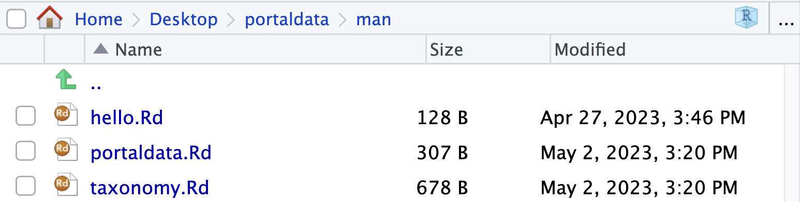

```{r setup, include=FALSE}
library(usethis)
#install.packages("formatR")
library(formatR)
knitr::opts_chunk$set(echo = TRUE, tidy.opts = list(width.cutoff = 50), tidy = TRUE)
```

### Create a new repository locally as an R package

With RStudio:

1. Click option to create a new project
2. Create a New directory
3. Choose create an R package
4. Give a name to the package
5. Click on `create in new session`

Once we have a backbone for an R package, start customizing it
- Modifying the DESCRIPTION file
- This files contains the metadata of the package
Metadata is "data about data", it contains the information about a data set.

- License GPL (>=2) is the most common for data packages
- Say something about the particularities of a GPL license
- Our package will only depend on R itself for now, that is no other packages 
  - It can be the latest version of R or any version that we are using


### Add a README file

We will use functions from a package that is called `usethis`. Install it:

```{r, eval = FALSE}
install.packages("usethis")
library(usethis)
```
The function `use_readme_md()` creates a template for a README file in markdown:
```{r}
use_readme_md()
```

Go to the README.md file and customize it with a description of the package.

### Adding data to the package

We are going to use the function `use_data_raw()`, this creates a folder called `data-raw/`. By default, it creates also an R script that will document the creation of the data objects that will be stored in our package.

In this R script called `DATASET.R`, we will document the steps needed to read the raw data into R, which is in CSV format:

1. Add the CSV file to the `data-raw/` folder. 
  - You can copy it from a location in your computer if you have downloaded it previously.
  - You can download it into your computer from [here](https://lunasare.github.io/spring2023-data-science/data/portal-species-taxonomy.csv).
  - You can download it directly to your R package repository with:
```{r, eval = FALSE, tidy.opts = list(width.cutoff = 50), tidy = TRUE}
download.file(url = "https://lunasare.github.io/spring2023-data-science/data/portal-species-taxonomy.csv",
              destfile = "data-raw/portal-species-taxonomy.csv")
```
2. Read the CSV file into R as a data frame of name `taxonomy`:
```{r, eval = FALSE}
taxonomy <- read.csv(file = "data-raw/portal-species-taxonomy.csv")
```
3. Finally, we will run a line of code to save the data object in R format `.rda`, shortcut for `rdata`. Make sure to replace `NAME_OF_DATA_OBJECT` with the nae of the data object that you created earlier.
```{r, eval = FALSE}
use_data(NAME_OF_DATA_OBJECT, overwrite = TRUE)
```
This is useful so that the data sets are always available when someone installs an R package.

IMPORTANT: Make sure to run all these steps in the DATASET.R file.

### Documenting the data (and functions)

Help for a function or data set can be accessed with the question mark `?`, or the function `help()`
But where are these documentation pages created and formatted?

There is a special folder called `man/` in every R package that stores files of type `.Rd`, shortcut for `Rdocument`.
These `.Rd` files store the information that is displayed in the documentation page of the data set or function.

To generate `.Rd` files, first we need to create an .R script in the R/folder called `data.R`.
Copy paste the following lines into the `data.R` file:

```{r, eval = FALSE}
#' Portal Data Set and Analysis
#'
#' This package contains data sets from the Portal Project
#' for easy reuse and reanalysis.
#'
#' @docType package
#' @name portaldata
#' @aliases portaldata portaldata-package
NULL

#' Taxonomy of species sampled
#'
#' A data set containing the taxonomy of species sampled for the Portal Project Data.
#' We followed the taxonomy from the Open Tree of Life .
#'
#' @source \url{https://lunasare.github.io/spring2023-data-science/data/portal-species-taxonomy.csv}
#' @format A data frame with X number of columns and Y number of rows
"taxonomy"
```

These lines contain instructions and information that will be displayed in the help page.

Make sure to modify the "X number" and "Y number" with the appropriate values from the data set.

---

To render the markdown instructions in the `data.R` script unto `.Rd` in the `man/` folder, we use the function `document()` from the package devtools:

```{r eval = FALSE}
install.packages("devtools")
library(devtools)
document() # run this line in the repo of your R package
```

After running `document()` in the console of your R package project in RStudio, you will see `.Rd` files in the folder `man/`:




### Version control

Now it's time to version control the R package:

1. Click on the `portaldata.Rproject` file.
2. Go to `Git/SVN` options.
3. On the `Version control system` drop down menu, choose `Git`.
4. Make sure that `Origin` is set correctly to your working directory. In my case, `Origin` is `git@github.com:LunaSare/portaldata.git`.

IMPORTANT: If `Origin` is something else, you probably nested your R package within another git repository. You are going to have to move The R package folder out and try the version control steps again.

If you were able to start git in your R package successfully, now go ahead and git add and git commit all the files (except for any temporary ones, like .DS_Store).
You won't be able to git push until we have created the remote copy of the repository, next.

### Remote repository

Now we can go to GitHub and create the remote repository for our package.
First, create a new repository and name it with the exact same name as your local R package. Leave all options unchecked and click `Create`.
Because we already have a local repository, were are going to run the code shown in section `...or push an existing repository from the command line`, from the command line.

Go to bash or (the terminal if you are in a Mac) and `cd` to where you have your R package repo. Once you are there, run `git status` to check that you have committed all the files in your repo already. If everything looks good, you are going to run the code from the section `...or push an existing repository from the command line`, in my case, it looks like the following:
```{bash, eval = FALSE}
git remote add origin git@github.com:LunaSare/portaldata.git
git branch -M main
git push -u origin main
```
Hopefully everything ran smoothly and you have a remote copy of your R package on GitHub.

